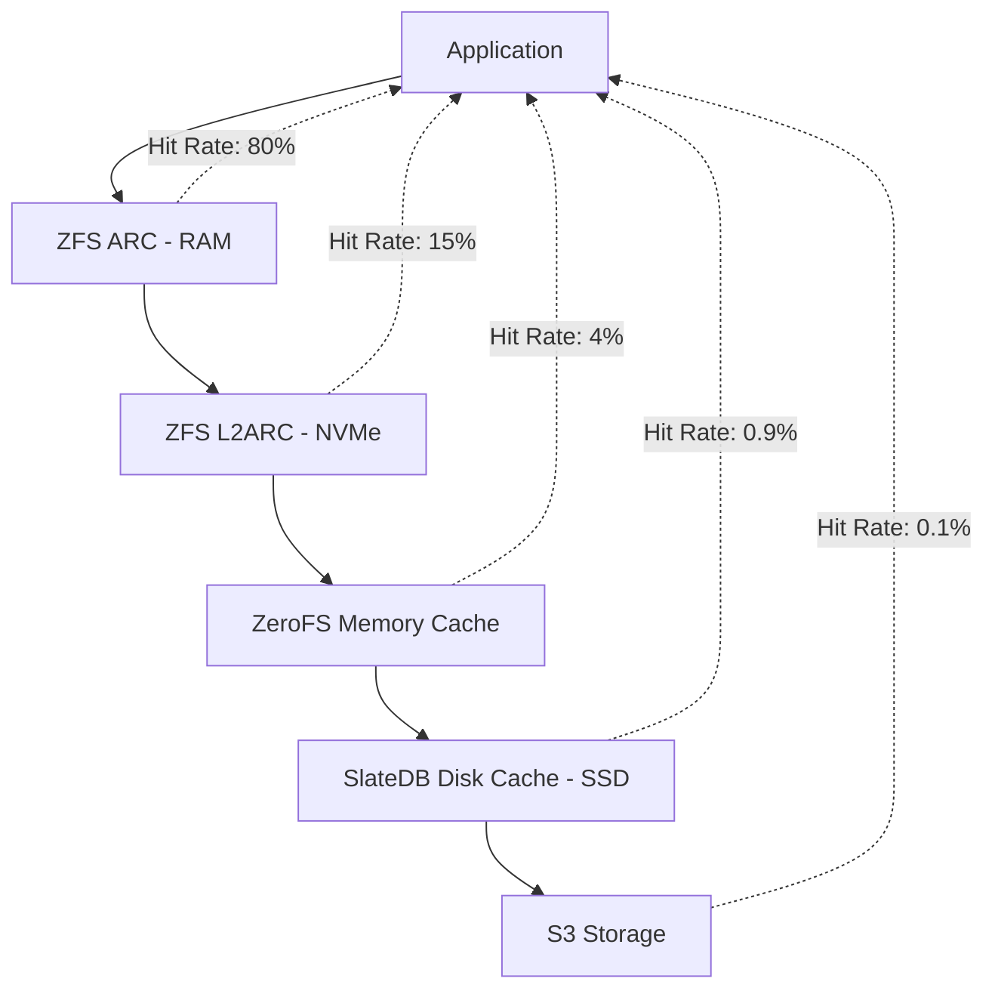

export const metadata = {
  title: 'Advanced Use Cases',
  description:
    'Explore advanced ZeroFS architectures including geo-distributed storage, tiered storage with ZFS, running databases, and CAP theorem considerations.',
}

# Advanced Use Cases

ZeroFS enables powerful architectures that were previously complex or expensive to implement. From geo-distributed ZFS pools to tiered storage systems, this guide explores advanced use cases that showcase ZeroFS's full potential for enterprise and innovative deployments. {{ className: 'lead' }}

<Note>
  These advanced architectures require careful planning and testing. Start with simpler configurations and gradually add complexity as you gain experience with ZeroFS.
</Note>

## Geo-Distributed Storage

Create globally distributed storage systems using ZeroFS instances across multiple regions:

<CodeGroup>

```bash {{ title: 'Multi-Region Setup' }}
# Terminal 1 - US East
ZEROFS_ENCRYPTION_PASSWORD='shared-key' \
AWS_DEFAULT_REGION=us-east-1 \
ZEROFS_NBD_PORTS='10809' \
ZEROFS_NBD_DEVICE_SIZES_GB='100' \
zerofs s3://my-bucket/us-east-db

# Terminal 2 - EU West
ZEROFS_ENCRYPTION_PASSWORD='shared-key' \
AWS_DEFAULT_REGION=eu-west-1 \
ZEROFS_NBD_PORTS='10810' \
ZEROFS_NBD_DEVICE_SIZES_GB='100' \
zerofs s3://my-bucket/eu-west-db

# Terminal 3 - Asia Pacific
ZEROFS_ENCRYPTION_PASSWORD='shared-key' \
AWS_DEFAULT_REGION=ap-southeast-1 \
ZEROFS_NBD_PORTS='10811' \
ZEROFS_NBD_DEVICE_SIZES_GB='100' \
zerofs s3://my-bucket/asia-db
```

```bash {{ title: 'Create Global ZFS Pool' }}
# Connect to NBD devices from each region with optimal settings
nbd-client 127.0.0.1 10809 /dev/nbd0 -N device_10809 -persist -timeout 60 -block-size 4096 -connections 4  # US East
nbd-client 192.168.1.2 10810 /dev/nbd1 -N device_10810 -persist -timeout 120 -block-size 4096 -connections 8  # EU West (remote)
nbd-client 192.168.1.3 10811 /dev/nbd2 -N device_10811 -persist -timeout 120 -block-size 4096 -connections 8  # Asia (remote)

# Create mirrored pool across continents
zpool create global-pool mirror /dev/nbd0 /dev/nbd1 /dev/nbd2

# Enable auto-trim for efficient space usage
zpool set autotrim=on global-pool

# Monitor pool status
zpool status global-pool
```

</CodeGroup>

### Benefits of Geo-Distribution

- **Disaster Recovery**: Data survives regional outages
- **Geographic Redundancy**: Automatic replication across continents
- **Read Performance**: Local reads from nearby regions
- **Compliance**: Data residency requirements met

## Tiered Storage Architecture

Combine ZeroFS with ZFS L2ARC for automatic storage tiering:

```bash
# Create S3-backed main pool
zpool create datapool /dev/nbd0 /dev/nbd1 /dev/nbd2

# Add local NVMe as L2ARC cache
zpool add datapool cache /dev/nvme0n1

# Add local SSD as SLOG for write performance
zpool add datapool log /dev/ssd0

# Monitor cache effectiveness
zpool iostat -v datapool 5
```

### Storage Hierarchy



## Database Architectures

### PostgreSQL with Streaming Replication

<CodeGroup>

```bash {{ title: 'Primary Database' }}
# Primary PostgreSQL on ZeroFS
ZEROFS_NBD_PORTS='10809' \
ZEROFS_NBD_DEVICE_SIZES_GB='500' \
zerofs s3://db-bucket/postgres-primary

# Mount and initialize
nbd-client 127.0.0.1 10809 /dev/nbd0
mkfs.xfs /dev/nbd0
mount /dev/nbd0 /var/lib/postgresql

# Configure PostgreSQL for replication
cat >> /etc/postgresql/16/main/postgresql.conf <<EOF
wal_level = replica
max_wal_senders = 3
wal_keep_size = 1GB
EOF
```

```bash {{ title: 'Standby Replicas' }}
# Standby 1 - Different region
ZEROFS_NBD_PORTS='10810' \
ZEROFS_NBD_DEVICE_SIZES_GB='500' \
AWS_DEFAULT_REGION='us-west-2' \
zerofs s3://db-bucket/postgres-standby1

# Mount and setup streaming replication
nbd-client 127.0.0.1 10810 /dev/nbd1
mount /dev/nbd1 /var/lib/postgresql

# Configure standby
pg_basebackup -h primary-host -D /var/lib/postgresql/16/main -U replicator -v -P -W

# Start in standby mode
cat > /var/lib/postgresql/16/main/standby.signal
systemctl start postgresql
```

</CodeGroup>

### MySQL/MariaDB Galera Cluster

```bash
# Node 1
ZEROFS_NBD_PORTS='10809' \
ZEROFS_NBD_DEVICE_SIZES_GB='200' \
zerofs s3://db-bucket/galera-node1

# Node 2 
ZEROFS_NBD_PORTS='10810' \
ZEROFS_NBD_DEVICE_SIZES_GB='200' \
zerofs s3://db-bucket/galera-node2

# Node 3
ZEROFS_NBD_PORTS='10811' \
ZEROFS_NBD_DEVICE_SIZES_GB='200' \
zerofs s3://db-bucket/galera-node3

# Each node has its own S3-backed storage
# Galera handles synchronous replication
```

## CAP Theorem and Distributed Systems

ZeroFS enables interesting CAP theorem trade-offs through its architecture:

### Shared Storage Architecture

```
  Client A ←→ Client B ←→ Client C
     ↓           ↓           ↓
     ├───────────┼───────────┤
     ↓           ↓           ↓
  PG Node 1   PG Node 2   PG Node 3
     ↓           ↓           ↓
     └───────────┼───────────┘
                 ↓
          Shared ZFS Pool
                 ↓
          Global ZeroFS
```

Key points:
- **Consistency**: Only one writer at a time (enforced by ZeroFS)
- **Availability**: Any accessible node can be promoted
- **Partition Tolerance**: System continues despite network partitions

### How It Works

1. **Normal Operation**: Primary has exclusive write access
2. **Partition Detected**: Client orchestrates failover
3. **Fencing**: Old primary cannot write (ZeroFS enforces)
4. **New Primary**: Client promotes accessible standby

## Container and Kubernetes Integration

### Persistent Volumes for Kubernetes

<CodeGroup>

```yaml {{ title: 'StorageClass Definition' }}
apiVersion: storage.k8s.io/v1
kind: StorageClass
metadata:
  name: zerofs-nfs
provisioner: kubernetes.io/no-provisioner
volumeBindingMode: WaitForFirstConsumer
---
apiVersion: v1
kind: PersistentVolume
metadata:
  name: zerofs-pv
spec:
  capacity:
    storage: 1Ti
  accessModes:
    - ReadWriteMany
  nfs:
    server: zerofs-service.storage.svc.cluster.local
    path: "/"
  storageClassName: zerofs-nfs
```

```yaml {{ title: 'ZeroFS Deployment' }}
apiVersion: apps/v1
kind: Deployment
metadata:
  name: zerofs
  namespace: storage
spec:
  replicas: 1
  selector:
    matchLabels:
      app: zerofs
  template:
    metadata:
      labels:
        app: zerofs
    spec:
      containers:
      - name: zerofs
        image: ghcr.io/barre/zerofs:latest
        env:
        - name: ZEROFS_ENCRYPTION_PASSWORD
          valueFrom:
            secretKeyRef:
              name: zerofs-secrets
              key: password
        - name: SLATEDB_CACHE_DIR
          value: "/cache"
        - name: SLATEDB_CACHE_SIZE_GB
          value: "100"
        volumeMounts:
        - name: cache
          mountPath: /cache
        command: ["zerofs", "s3://bucket/k8s-storage"]
      volumes:
      - name: cache
        emptyDir:
          sizeLimit: 100Gi
```

</CodeGroup>

### Docker Compose for Development

```yaml
version: '3.8'
services:
  zerofs:
    image: ghcr.io/barre/zerofs:latest
    environment:
      ZEROFS_ENCRYPTION_PASSWORD: ${ZEROFS_PASSWORD}
      SLATEDB_CACHE_DIR: /cache
      SLATEDB_CACHE_SIZE_GB: 50
      AWS_ACCESS_KEY_ID: ${AWS_ACCESS_KEY_ID}
      AWS_SECRET_ACCESS_KEY: ${AWS_SECRET_ACCESS_KEY}
      ZEROFS_NBD_PORTS: "10809,10810"
      ZEROFS_NBD_DEVICE_SIZES_GB: "10,20"
    volumes:
      - cache:/cache
    ports:
      - "2049:2049"
      - "10809-10810:10809-10810"
    command: s3://dev-bucket/docker-data
    
  postgres:
    image: postgres:16
    depends_on:
      - zerofs
    volumes:
      - type: volume
        source: postgres-data
        target: /var/lib/postgresql/data
        volume:
          driver: local
          driver_opts:
            type: nfs
            o: addr=zerofs,vers=3,tcp,port=2049
            device: ":/postgres"
            
volumes:
  cache:
  postgres-data:
```

## Self-Hosting ZeroFS

ZeroFS can even host itself, creating a bootstrapping environment:

```bash
# Start initial ZeroFS instance
ZEROFS_ENCRYPTION_PASSWORD='bootstrap' \
zerofs s3://bucket/bootstrap

# Mount it
mount -t nfs -o vers=3 127.0.0.1:/ /mnt/bootstrap

# Build ZeroFS on ZeroFS
cd /mnt/bootstrap
git clone https://github.com/Barre/ZeroFS
cd ZeroFS
cargo build --release

# Now you're compiling on S3-backed storage!
```
### Advanced NBD Configuration

```bash
# High-performance NBD setup
for i in {0..7}; do
  echo 2048 > /sys/block/nbd$i/queue/read_ahead_kb
  echo 256 > /sys/block/nbd$i/queue/nr_requests
  echo deadline > /sys/block/nbd$i/queue/scheduler
done

# RAID0 for performance (RAID1/5/6 for redundancy)
mdadm --create /dev/md0 --level=0 --raid-devices=8 \
  /dev/nbd0 /dev/nbd1 /dev/nbd2 /dev/nbd3 \
  /dev/nbd4 /dev/nbd5 /dev/nbd6 /dev/nbd7

# Format with optimal settings
mkfs.xfs -f -d su=128k,sw=8 /dev/md0
```

## Future Possibilities

ZeroFS opens doors to new architectures:

1. **Serverless Databases**: Spin up database instances on-demand
2. **Edge Computing**: Run workloads close to data with local caches
3. **Hybrid Cloud**: Seamlessly move data between clouds
4. **Time-Travel Storage**: Snapshot and restore using SlateDB checkpoints
5. **Multi-Protocol Access**: Same data via NFS, NBD, and future protocols

<Note>
  These advanced use cases demonstrate ZeroFS's flexibility. Start simple and gradually adopt more complex architectures as your needs grow.
</Note>

<div className="not-prose">
  <Button href="/" variant="text" arrow="left">
    <>Back to documentation home</>
  </Button>
</div>
